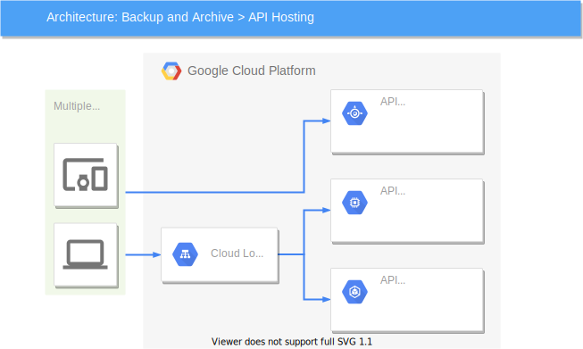

## [WIP]Fishapp

### 【概要】

釣りに一緒に行く人を探せるアプリです。掲示板形式で、釣り場所や魚種や時間を指定して一緒に行く人を募集できます。マッチング後、当日について参加者同士でチャットができます。

釣りをしたいけどやり方がわからない、一歩を踏み出せない人と、経験者だけど誰かと一緒に釣りしたい！って人をマッチングできたらいいなと思い作りました。

### 【アプリ】
Cloud NativeやMicroservicesに興味を持ち勉強のために取り入れてみました。友達と共同開発し友達はフロント、僕はサーバー、インフラを担当しています(開発中)。

api-gateway, user, chat, image, relaylogのマイクロサービスがあり、api-gatewayをGraphQLで実装し、他のマイクロサービスにプロキシしています。

protobufやGraphQLのスキーマは[schema](/schema/README.md)にあり、バックエンドは全てGolangでClean Architectureで実装しています。

### 【DB設計】
tblsで自動生成しています。

[post-db](/microservices/post/db/README.md)

[user-db](/microservices/user/db/README.md)

[chat-db](/microservices/chat/db/README.md)

[image-db](/microservices/image/db/README.md)

### 【インフラ】

GCPのGKEを使用しています。TerraformでGKEクラスター、サービスアカウントなどを作成しています。

GCPのConfig Connectorで、アプリケーションが使うGCPリソースをKubernetes上で作成しています。GCSのバケット、Cloud SQL、サービスアカウント(GCP)を作成しています。

本番のMySQL, Redis, NatsにKubernetes Operatorを使っており、イメージのビルド、プッシュ、terraformやk8sのマニフェストの適用は、Github Actions上で行っています。secretはローカルでkubesecで暗号化し、Github Actions上で復号化しています。また、スキーマドキュメントの生成などもGithub Actionsで行っています。

## 【使用技術】

- アプリケーション
  - Golang
  - GraphQL
  - gRPC
  - JWT
  - ミドルウェア
    - Redis
    - MySQL
    - Nats Streaming
- インフラ
  - 開発
    - Kubernetes
    - Minikube
    - Helm
    - Skaffold
    - Docker/docker-compose
  - 本番
    - GCP
      - Cloud SQL
      - Cloud Storage
      - Container Registry
      - Cloud DNS
      - Config Connector
    - Helm
    - Kubernetes Operator
    - Terraform
    
  - CI/CD
    - Github Actions

## Architecture
- Clean Architecture
- Microservices pattern
- Api-gateway pattern
- Event driven pattern
- Saga pattern

<!-- ### api-gateway API
#### 機能
- 参照系クエリの集約
- dataloaderを使った参照系クエリの集約
- 更新系クエリのプロキシ
- JWTの検証による認証
- バックのマイクロサービスに必要な認可

Golangのライブラリのgqlgenを使ってGraphQLサーバーとして実装しています。JWTの検証による認証や認可、参照系クエリの集約、更新系クエリのプロキシなどを担当しています。

チャットメッセージを取得する時にチャットルームのメンバーかどうか確認するなどの認可を担当しています。

JWTのパブリックキーを持っており、トークンの発行はできず、検証のみ可能になっています。

なるべくビジネスロジックを持たないように実装しました。

特に複数APIのリソースの更新が必要な場合
### user API
#### 機能
- 現在のユーザー情報取得(ID Tokenが必要)
- ユーザー情報取得(メール以外)
- ユーザー作成 (ユーザー情報の保存、ID Token, Refresh Tokenの発行)
- ユーザー更新 (パスワード以外のユーザー情報の更新, ID Tokenが必要)
- パスワード更新(ID Tokenが必要)
- ログアウト (Refresh Tokenをブラックリストに登録)
- ログイン (メール, パスワードで認証し、ID Token, Refresh Tokenの発行)
- ID Tokenの更新(ID Token, Refresh Tokenの発行、古いRefresh Tokenのブラックリスト。Refresh Tokenが必要)

ユーザーが作られるか、ログインしたら有効期限が一時間のID Tokenが発行され、期限がきれたらRefresh Tokenを使ってID Tokenを更新する必要があります。

Refresh Tokenの有効期限は10日間です。Refresh Tokenが漏洩したときに備え、ログアウトする時にRedisでRefresh Tokenをブラックリストに登録しています。

Refresh Tokenを使ってID Tokenを更新するときに、Redisにブラックリスト登録されているか確認しています。

user APIは、他のAPIリソースに関わる認証は担当しておらず、api-gatewayでJWTを検証することで認証しています。

### post API
#### 機能
- 投稿の取得
- 投稿の一覧の取得
- 投稿を作成
- 投稿を更新
- 投稿を削除
- 投稿の応募を作成
- 投稿の応募を削除
- 投稿の応募一覧を取得

認証認可はapi-gatewayしているため、トークンは受け取りません。

投稿の一覧の取得をする際、絞り込み検索やページネーションもできるようになっています。

投稿を作成する際、chatAPIにチャットルーム作成のクエリ、imageAPIにイメージの作成のクエリを投げなければいけないのですが、どれかが失敗したときのデータ整合性担保にすごく悩みました。

結果、Saga Patternを試してみようと思ったのですが、非同期、イベント駆動の考え方が難しく中途半端な形になっています。

### chat API
#### 機能
- チャットルームを取得
- チャットルームを作成
- チャットルームのメンバーか確認
- チャットルームのメンバー一覧取得
- チャットルームのメッセージ一覧取得
- チャットルームのメッセージ作成
- チャットルームのメッセージをストリームで取得

画像データはimage APIにプロキシしています。

チャットルーム、メンバー、メッセージはMySQLに永続化しています。

メッセージを作成したら、Redisにパブリッシュしています。

gRPCのサーバーサイドストリーミングを使い、Redisで新着メッセージをサブスクライブしています。

### image API
#### 機能
- 投稿、メッセージ、ユーザーに紐づく画像をGCSにアップロード
- MySQLに画像のメタデータを永続化
- GCSにアップロードした画像を削除、MySQLのデータも削除
- 画像データをチャンク化し、クライアントストリーミングで受け取る
- 画像の一覧取得
- 画像を作成
- 画像を削除

投稿, メッセージ, ユーザーに紐づく画像をGCSにアップロード、メタデータをMySQLに永続化しています。

画像データを受け取る際、チャンク化しクライアントストリーミングで受け取っています。

画像のメタデータ取得は画像オーナーではなく、api-gatewayが取得しています。

### relaylog API
#### 機能
- データベースのバイナリログを監視し、outboxテーブルのイベントをnatsにパブリッシュする

outbox patternのrelaylogです。

他APIのデータベースのバイナリログを監視し、outboxテーブルに入ったイベント情報を取り出し、natsにパブリッシュしています。

outbox patternはイベントをデータベースに保存することで発行できるので、集約の永続化と、イベントの発行を同じトランザクションでできます。

イベントはprotobufで定義し、json化してパブリッシュしています。
