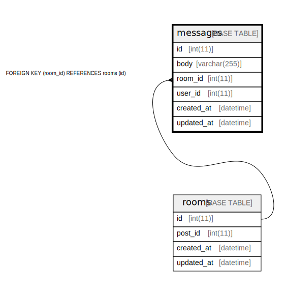

# messages

## Description

<details>
<summary><strong>Table Definition</strong></summary>

```sql
CREATE TABLE `messages` (
  `id` int NOT NULL AUTO_INCREMENT,
  `body` varchar(255) COLLATE utf8mb4_ja_0900_as_cs NOT NULL,
  `room_id` int NOT NULL,
  `user_id` int NOT NULL,
  `created_at` datetime NOT NULL,
  `updated_at` datetime NOT NULL,
  PRIMARY KEY (`id`),
  KEY `room_id` (`room_id`),
  CONSTRAINT `messages_ibfk_1` FOREIGN KEY (`room_id`) REFERENCES `rooms` (`id`) ON DELETE CASCADE
) ENGINE=InnoDB DEFAULT CHARSET=utf8mb4 COLLATE=utf8mb4_ja_0900_as_cs
```

</details>

## Columns

| Name | Type | Default | Nullable | Children | Parents | Comment |
| ---- | ---- | ------- | -------- | -------- | ------- | ------- |
| id | int |  | false |  |  |  |
| body | varchar(255) |  | false |  |  |  |
| room_id | int |  | false |  | [rooms](rooms.md) |  |
| user_id | int |  | false |  |  |  |
| created_at | datetime |  | false |  |  |  |
| updated_at | datetime |  | false |  |  |  |

## Constraints

| Name | Type | Definition |
| ---- | ---- | ---------- |
| messages_ibfk_1 | FOREIGN KEY | FOREIGN KEY (room_id) REFERENCES rooms (id) |
| PRIMARY | PRIMARY KEY | PRIMARY KEY (id) |

## Indexes

| Name | Definition |
| ---- | ---------- |
| room_id | KEY room_id (room_id) USING BTREE |
| PRIMARY | PRIMARY KEY (id) USING BTREE |

## Relations



---

> Generated by [tbls](https://github.com/k1LoW/tbls)
