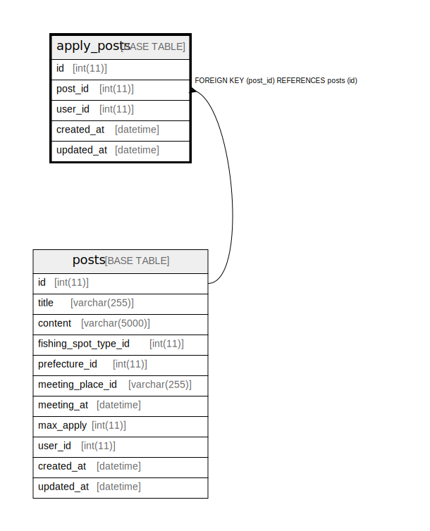

# apply_posts

## Description

<details>
<summary><strong>Table Definition</strong></summary>

```sql
CREATE TABLE `apply_posts` (
  `id` int(11) NOT NULL AUTO_INCREMENT,
  `post_id` int(11) NOT NULL,
  `user_id` int(11) NOT NULL,
  `created_at` datetime NOT NULL,
  `updated_at` datetime NOT NULL,
  PRIMARY KEY (`id`),
  UNIQUE KEY `post_id` (`post_id`,`user_id`),
  CONSTRAINT `apply_posts_ibfk_1` FOREIGN KEY (`post_id`) REFERENCES `posts` (`id`) ON DELETE CASCADE
) ENGINE=InnoDB DEFAULT CHARSET=utf8mb4 COLLATE=utf8mb4_unicode_ci
```

</details>

## Columns

| Name | Type | Default | Nullable | Children | Parents | Comment |
| ---- | ---- | ------- | -------- | -------- | ------- | ------- |
| id | int(11) |  | false |  |  |  |
| post_id | int(11) |  | false |  | [posts](posts.md) |  |
| user_id | int(11) |  | false |  |  |  |
| created_at | datetime |  | false |  |  |  |
| updated_at | datetime |  | false |  |  |  |

## Constraints

| Name | Type | Definition |
| ---- | ---- | ---------- |
| apply_posts_ibfk_1 | FOREIGN KEY | FOREIGN KEY (post_id) REFERENCES posts (id) |
| post_id | UNIQUE | UNIQUE KEY post_id (post_id, user_id) |
| PRIMARY | PRIMARY KEY | PRIMARY KEY (id) |

## Indexes

| Name | Definition |
| ---- | ---------- |
| PRIMARY | PRIMARY KEY (id) USING BTREE |
| post_id | UNIQUE KEY post_id (post_id, user_id) USING BTREE |

## Relations



---

> Generated by [tbls](https://github.com/k1LoW/tbls)
