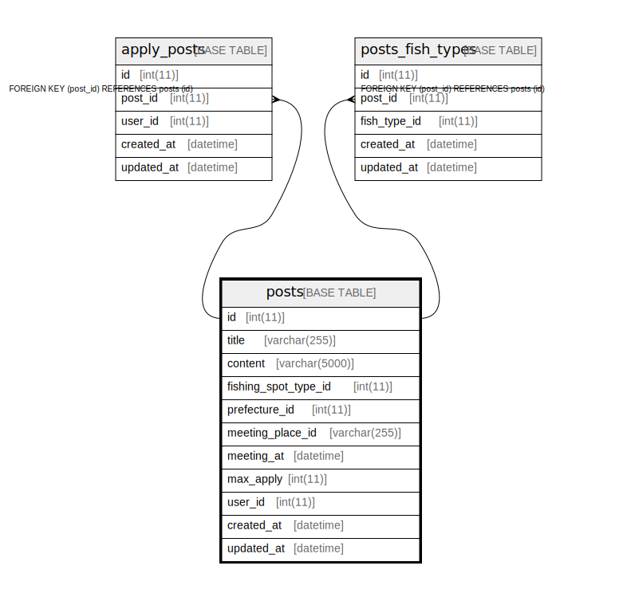

# posts

## Description

<details>
<summary><strong>Table Definition</strong></summary>

```sql
CREATE TABLE `posts` (
  `id` int NOT NULL AUTO_INCREMENT,
  `title` varchar(255) COLLATE utf8mb4_ja_0900_as_cs NOT NULL,
  `content` varchar(5000) COLLATE utf8mb4_ja_0900_as_cs NOT NULL,
  `fishing_spot_type_id` int NOT NULL,
  `prefecture_id` int DEFAULT NULL,
  `meeting_place_id` varchar(255) COLLATE utf8mb4_ja_0900_as_cs NOT NULL,
  `meeting_at` datetime NOT NULL,
  `max_apply` int NOT NULL,
  `user_id` int NOT NULL,
  `created_at` datetime NOT NULL,
  `updated_at` datetime NOT NULL,
  PRIMARY KEY (`id`)
) ENGINE=InnoDB DEFAULT CHARSET=utf8mb4 COLLATE=utf8mb4_ja_0900_as_cs
```

</details>

## Columns

| Name | Type | Default | Nullable | Children | Parents | Comment |
| ---- | ---- | ------- | -------- | -------- | ------- | ------- |
| id | int |  | false | [apply_posts](apply_posts.md) [posts_fish_types](posts_fish_types.md) |  |  |
| title | varchar(255) |  | false |  |  |  |
| content | varchar(5000) |  | false |  |  |  |
| fishing_spot_type_id | int |  | false |  |  |  |
| prefecture_id | int |  | true |  |  |  |
| meeting_place_id | varchar(255) |  | false |  |  |  |
| meeting_at | datetime |  | false |  |  |  |
| max_apply | int |  | false |  |  |  |
| user_id | int |  | false |  |  |  |
| created_at | datetime |  | false |  |  |  |
| updated_at | datetime |  | false |  |  |  |

## Constraints

| Name | Type | Definition |
| ---- | ---- | ---------- |
| PRIMARY | PRIMARY KEY | PRIMARY KEY (id) |

## Indexes

| Name | Definition |
| ---- | ---------- |
| PRIMARY | PRIMARY KEY (id) USING BTREE |

## Relations



---

> Generated by [tbls](https://github.com/k1LoW/tbls)
